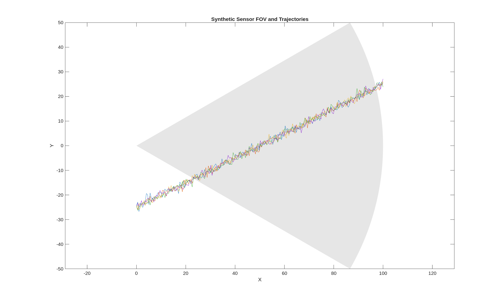

<p align="left">
  <a href="https://www.mathworks.com/products/matlab.html">
    
  </a>
  <a href="./LICENSE">
    
  </a>
</p>

# Field of View (FOV) Visualization

MATLAB scripts to visualize sensor **fields of view (FOVs)** and plot trajectories within those FOVs.  
Results (example image) are written to `results/`.

## Quickstart

1. From MATLAB Desktop, run:
   ```matlab
   run('run_demo.m')
Or from the command line:

bash
Copy code
matlab -batch "run('run_demo.m')"
Outputs will be saved to:

bash
Copy code
results/fov_example.png
Repository Structure
graphql
Copy code
.
├── data/           # (optional) input CSVs for scenarios
├── results/        # generated figures
├── run_demo.m      # entrypoint to produce the example figure
├── .gitignore
├── LICENSE
└── README.md
Example Output
After running the demo, the README image below will render automatically.

<p align="center">  </p>
Requirements
MATLAB R2022a+

(Optional) relevant toolboxes if you enable advanced features

Installation
bash
Copy code
git clone https://github.com/gordonmurray-coding/field-of-view-visualization.git
cd field-of-view-visualization
Data
If your scenario needs inputs, place the required CSVs in data/ and adjust run_demo.m accordingly.

License
This project is licensed under the MIT License.
